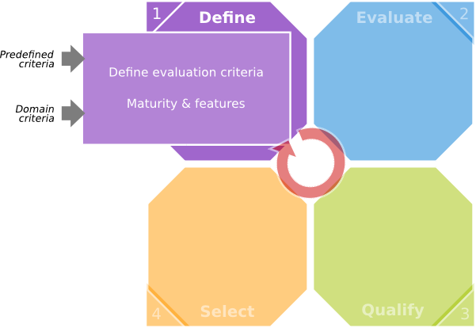

# Step 1 : Define

## Purpose

The purpose of this step is to define different elements of typology that will be used during the next three steps of process.

The different typological reference are :

* type of software : the hierarchical classification of types of software and the description of functional coverage linked to every type in the form of templates ;

* type of license : classification of types of free and open source licenses in use ;

* type of community : classification of types of community organizations around the software to ensure the life cycle.

## Type of software reference

It's the reference that change the most because, as software change, it offer new features that have to be added.

The templates of this reference is composed of hierarchical criteria, grouped by axes :

* maturity analysis of the project in charge of the software development ;

* functional coverage analysis of the software.

The QSOS method defines and imposes the maturity criteria of a project.

These criteria must be used in every single QSOS evaluation. They are detailed in the appendix of this document.

The other criteria are specific to a functional domain of which the evaluated software belong.

Visit the website <http://www.qsos.org> to see the available templates and to be guided to the creation of new templates.

## Type of license reference

There are many free and open source licenses. The purpose of this reference is to identify and categorize them according to the following axes:

* Copyleft : can derivative works become proprietary or have to stay under the same conditions ?

* Virality : does the use of the software from a module implies that this module has to be under the same license ?

* Inheritance : does the derivative work inherit from the license or is it possible to add restrictions ?

The following array list the mostly used licenses with the properties described above:

License                      Copyleft           Virality     Inheritance
------------------------ ------------------- -------------- -------------
GNU Public License              Yes              Yes           Yes
CeCILL                          Yes              Yes           Yes
LGPL                            Yes              Partial       Yes
BSD and BSD-like                No               No            No
Artistic                        No               No            No
MIT                             No               No            No
Apache Software License         No               No            No
Mozilla Public License          Yes              No            Yes
Common Public License           Yes              No            No
Academic Free License           No               No            No
PHP License                     No               No            No
Open Software License           Yes              No            No
Zope Public License             No               No            No
Python SF License               No               No            No

You can visit the website of _SLIC_^[<http://slic.drakkr.org>] (Software LIcense Comparator) for a more detailed description of the free and open source software and their compatibilities.

NB: software can be distributed under several licenses, including proprietary ones.

## Type of community reference

So far, the type of identified communities are:

* sole developer : the software is developed by a sole person ;

* group of developers : several person working together without formal processes ;

* developers organization : a group a developers using a software lifecycle management system formalized and respected, based on roles (developers, validator, delivery manager...) and meritocracy ;

* legal entity : a legal entity, often a non for-profit, manages the community and the sponsorship and holds the copyrights.

* Commercial entity : a commercial entity employs the core developers of the project and gets revenue from the sale of services or commercial version of the software.
