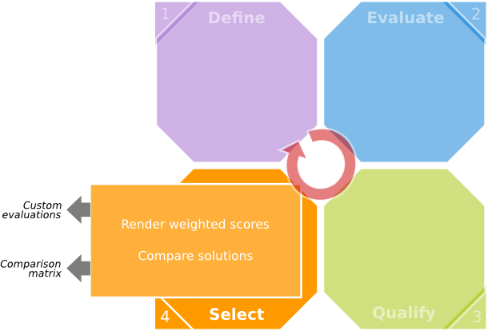
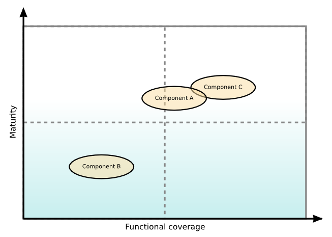

# Step 4 : Select

## Purpose

The purpose of this step is to select the software matching the user's needs, or to compare the software of the same type.

## Select mode

Two modes are available :

* strict selection ;

* loose selection.

### Strict selection

the strict selection is made by a process of elimination as soon as a piece of software does not comply with the demands :

* elimination of the software that don't go through the identity filter ;

* elimination of the software that don't provide the required functionalities ;

* elimination of the software whose maturity criteria don't match with the degree of relevance defined by the user :

    + the score of a relevant criterion must be greater than or equal to 1 ;
 
    + the score of a critical criterion must be equal to 2.

Depending on the demands of the user, this strict selection can return no eligible software.

The software that went through the selection process are then assigned a global weighted score, in the same way as the loose selection.

### Loose selection

This selection is less strict than the previous one because instead of eliminating software that are non eligible, it sort them while measuring the difference compared to the filters previously defined.

It is based on the weighting values whose rules are detailed in the following paragraphs.

__Weighting of functionalities__

The weighting factor is based on the level of requirements of every functionality of the functionality coverage.

Level of requirement          Weighting
---------------------------- ---------------
Required functionality           3
Optional functionality           1
Not required functionality       0

__Weighting of maturity__

The weighting factor is based on the degree of relevance of every maturity criteria.

Degree of relevance           Weighting
---------------------------- ---------------
Critical criterion              3
Relevant criterion              1
Not relevant criterion          0

### Comparison

The software of the same domain may also be compared with one another according to the weighted score from the previous steps.

The following figures show possible synthesis. The O3S application, described further, allows to export the comparisons in different format (OpenDocument, HTML and SVG).

