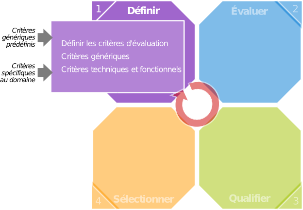

# Étape 1 : Définir

## Objectif

L'objectif de cette étape est de définir différents éléments de typologie réutilisés par les trois étapes suivantes du processus général.

Les différents référentiels typologiques concernés sont les suivants :

* types de logiciels : classification hiérarchique de types de logiciels et description des couvertures fonctionnelles associées à chaque type sous forme de templates ;

* types de licences : classification des types de licences libres et Open Source utilisées ;

* types de communautés : classification des types d'organisations communautaires existant autour d'un logiciel Open Source pour en assurer le cycle de vie.

## Référentiel des types de logiciels

Il s'agit du référentiel qui évolue le plus car, au fur et à mesure que les logiciels évoluent, ils offrent de nouvelles fonctionnalités qu'il est nécessaire d'y ajouter.

Les templates constituant ce référentiel sont composés de critères organisés de manière hiérarchique. Ils sont regroupés selon plusieurs axes d'analyse :

* analyse de la maturité du projet en charge du développement du logiciel ;

* analyse de la couverture fonctionnelle du logiciel.

La méthode QSOS définit et impose les critères d'évaluation de la maturité d'un projet.

Ces critères doivent obligatoirement être utilisés dans toute évaluation QSOS. Ils sont détaillés en annexe du présent document.

Les autres critères d'évaluation sont spécifiques au domaine fonctionnel auquel appartiennent les logiciels évalués.

Consultez le site Web <http://www.qsos.org> pour le détail des templates disponibles ainsi que pour être guidé dans la construction de nouveaux templates d'évaluation.

## Référentiel des types de Licences

Il existe de nombreuses licences libres et open source, ce référentiel a pour objectif de les identifier et de les catégoriser selon les axes suivants :

* propriétarisation : le code dérivé peut-il être rendu propriétaire ou doit-il rester libre ?

* persistance : l'utilisation du code du logiciel à partir d'un autre module se traduit-il ou non par la nécessité que ce module soit placé sous la même licence ?

* héritage : le code dérivé hérite-il obligatoirement de la licence où est-il possible d'y appliquer des restrictions supplémentaires ?

Le tableau suivant liste les licences les plus souvent utilisées en les comparant par rapport aux critères énoncés plus haut.

Licence                   Propriétarisation    Persistance   Héritage
------------------------ ------------------- -------------- ----------
GNU Public License              Non              Oui         Oui
CeCILL                          Non              Oui         Oui
LGPL                            Non           Partielle      Oui
BSD et dérivées                 Oui              Non         Non
Artistic                        Oui              Non         Non
MIT                             Oui              Non         Non
Apache Software License         Oui              Non         Non
Mozilla Public License          Non              Non         Oui
Common Public License           Non              Non         Non
Academic Free License           Oui              Non         Non
PHP License                     Oui              Non         Non
Open Software License           Non              Non         Non
Zope Public License             Oui              Non         Non
Python SF License               Oui              Non         Non

 Vous pouvez vous reporter au projet _SLIC_^[<http://slic.drakkr.org>] (Software LIcense Comparator) pour une description plus complète et plus formelle des licences libres et open source ainsi que de leur compatibilités respectives.

Il convient de noter qu'un même logiciel peut être assujetti à plusieurs licences différentes (y compris propriétaires).

## Référentiel des types de communautés

Les types de communautés identifiés à ce jour sont :

* développeur isolé : le logiciel est développé et géré par une seule personne ;

* groupe de développeurs : plusieurs personnes travaillant ensemble de manière informelle ou pas fortement industrialisée ;

* organisation de développeurs : il s'agit d'un groupe de développeurs utilisant un mode de gestion du cycle de vie du logiciel formalisé et respecté, généralement basé sur l'attribution de rôles (développeur, validateur, responsable de livraison...) et la méritocratie ;

* entité légale : une entité légale, en général à but non lucratif, chapeaute la communauté pour généralement prendre en charge la détention des droits d'auteur ou gérer le sponsorat et les subventions associées ;

* entité commerciale : une entité commerciale emploie les développeurs principaux du projet et se rémunère sur la vente de services ou de versions commerciales du logiciel.
